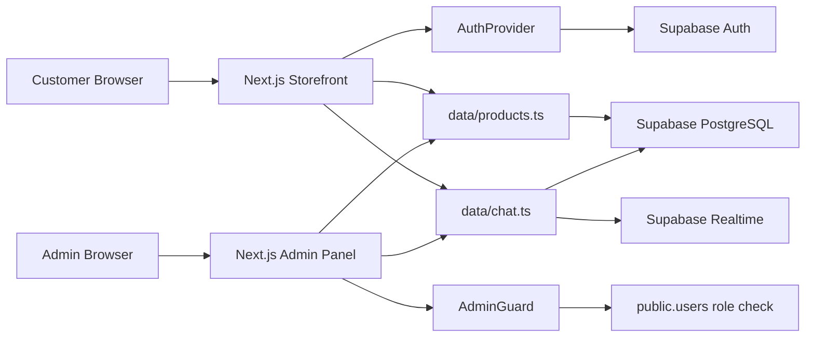

# 0002 - System Architecture and Operational Overview

**Date:** 2026-07-05  
**Status:** Accepted  
**Project:** Zenith Premium E-Commerce

## Context

Zenith is a premium e-commerce web application that has evolved from a static mockup into a working Next.js application connected to Supabase. The system now includes storefront shopping, customer authentication, order creation and history, product reviews, an admin panel, order management, review moderation, and customer support live chat.

This ADR documents the current architecture so developers, reviewers, and presentation audiences can understand how the system works, why key choices were made, and what areas are ready for future phases.

## Decision

The application uses a client-first Next.js App Router architecture with Supabase as the hosted backend service.

- **Frontend:** Next.js 16, React 19, TypeScript, Tailwind CSS v4.
- **Backend/Data:** Supabase PostgreSQL, Supabase Auth, Supabase Realtime for chat updates.
- **Auth:** Supabase Auth with email/password and GitHub OAuth.
- **Authorization:** Role-based access through the local `users.role` field.
- **Deployment target:** Vercel for the Next.js application and Supabase for backend services.

The app intentionally keeps the first production-ready phase simple: business logic is implemented in shared client data helpers, and Supabase RLS is the main backend security boundary.

## System Overview



## Main User Flows

### Customer Storefront

1. Customer opens `/` or `/products`.
2. Product catalog loads active products from Supabase.
3. Customer adds products to the cart.
4. If checkout requires authentication and the customer is not signed in, the app sends the user to sign in.
5. After successful sign in, the customer returns and the cart/order context remains usable.
6. Checkout creates an `orders` record plus related `order_items`.
7. Customer can view order history in the purchase history modal and `/account`.
8. Customer can submit reviews with:
   - anonymous display name,
   - custom public display name,
   - real account still visible to admin through `user_id`.

### Admin Panel

1. Admin opens `/admin`.
2. `/admin` redirects to `/admin/products`.
3. `AdminGuard` checks the signed-in user profile from `public.users`.
4. Allowed roles are `admin`, `staff`, and `support`.
5. Admin can:
   - manage products,
   - review orders,
   - update order status and tracking number,
   - audit/delete reviews,
   - respond to live chat.

### Live Chat

1. Customer opens chat widget from the storefront.
2. General support chat creates or reuses a `chat_threads` row with `order_id = null`.
3. From `/account`, customer can ask about a specific order.
4. Order-specific chat creates or reuses a `chat_threads` row with `order_id`.
5. Messages are stored in `chat_messages`.
6. Customer messages move thread status toward `waiting_admin`.
7. Admin replies move thread status toward `waiting_customer`.
8. Admin chat inbox joins order context when `order_id` exists.

## Core Data Model

The main operational tables are:

- `users`: local profile and role record mapped to Supabase Auth users.
- `categories`: product taxonomy.
- `products`: catalog, price, stock, active status.
- `product_images`: gallery images for each product.
- `reviews`: product reviews with optional `display_name`.
- `orders`: order header, totals, shipping address, status, tracking number.
- `order_items`: line-item snapshot of purchased products and prices.
- `chat_threads`: customer support conversations, optionally linked to orders.
- `chat_messages`: message history and read state.

Important design choices:

- Product deletion is a soft operation by setting `is_active = false`.
- Order items store `unit_price` snapshots so old orders stay accurate even if product prices change later.
- Reviews store both public `display_name` and private `user_id` for audit.
- Admin permissions are based on `users.role`, not separate admin login records.
- Customer order history must query by `user_id` to prevent different accounts seeing the same orders.

## Authentication and Authorization

Supabase Auth owns authentication sessions. The app supports:

- GitHub OAuth through Supabase.
- Email/password sign in and sign up.
- Persistent client sessions through Supabase client auth settings.

Admin access is separate at the route/UX level, but uses the same auth identity system:

- Customer login page: `/login`
- Admin login page: `/admin/login`
- Admin panel guard: `AdminGuard`
- Valid admin roles: `admin`, `staff`, `support`

This avoids duplicate accounts for the same person while still letting the system distinguish customer and back-office privileges.

## Frontend Architecture

The frontend is organized around App Router routes and reusable components.

Key areas:

- `app/page.tsx`: storefront home.
- `app/products/page.tsx`: catalog page.
- `app/account/page.tsx`: customer profile, order history, reviews.
- `app/login/page.tsx`: customer login.
- `app/auth/callback/page.tsx`: Supabase auth callback handling.
- `app/admin/*`: admin products, orders, reviews, chat, login.
- `hooks/useStorefront.ts`: shared storefront cart, checkout, auth-aware flow, reviews, orders.
- `data/products.ts`: product, review, order, admin data helpers.
- `data/chat.ts`: customer/admin chat helpers and Realtime subscriptions.

UI/UX decisions:

- Customer-facing pages use skeleton loading and route error fallbacks.
- Admin pages use admin-specific skeletons and dashboard-style error states.
- Admin layout supports theme switching with Tailwind v4 class-based dark mode.
- Light mode includes an admin theme bridge for older dark-first admin components.

## Deployment Architecture

Production deployment is intended to use:

- **Vercel:** hosts the Next.js application.
- **Supabase:** hosts database, auth, Realtime, and RLS policies.
- **GitHub:** source repository and deploy trigger.

Required Vercel environment variables:

```text
NEXT_PUBLIC_SUPABASE_URL
NEXT_PUBLIC_SUPABASE_KEY
```

Supabase Auth must allow the deployed domain:

- Site URL: production Vercel or custom domain.
- Redirect URL: `/auth/callback` on the production domain.
- Preview deploy URLs can be added if preview testing is required.

## Quality and Verification

Current standard checks:

```bash
npm.cmd run lint
npm.cmd run build
```

Expected current lint state:

- Build passes.
- Lint has existing warnings about `` usage. These do not block deployment but can be improved later by migrating selected images to `next/image`.

Recommended demo path:

1. Open storefront and browse products.
2. Add product to cart.
3. Sign in as customer.
4. Checkout and create an order.
5. Open `/account` and show order details.
6. Submit a review with custom display name or anonymous name.
7. Open admin panel.
8. Show products, orders, reviews, and chat.
9. Update order status/tracking.
10. Demonstrate light/dark admin theme.

## Consequences

### Positive

- Uses managed services, reducing backend infrastructure work.
- Supabase Auth and RLS provide a practical security baseline.
- Next.js App Router keeps storefront and admin routes in one deployable app.
- Shared data helpers make Supabase queries consistent across customer/admin views.
- Admin review audit keeps public privacy and internal accountability together.
- Order-linked chat improves customer support context.

### Trade-offs

- Much of the data access is client-side, so RLS correctness is critical.
- Admin and storefront live in one app, so route guards and role policies must stay strict.
- Some admin styling still uses a compatibility bridge until all admin components are fully theme-tokenized.
- Payment is still simulated; no real payment provider or shipment API is integrated yet.

## Future Improvement Candidates

- Add real payment integration such as Stripe.
- Add saved customer addresses.
- Add product detail routes such as `/products/[id]`.
- Replace remaining `` tags with `next/image` where appropriate.
- Add audit logs for admin mutations.
- Add production monitoring and error reporting.
- Add email or LINE notifications for orders and chat.
- Move selected admin mutations to server actions or route handlers if stronger backend control is needed.

## Presentation Summary

Zenith demonstrates a realistic e-commerce workflow with:

- premium storefront UI,
- customer authentication,
- persistent cart and order history,
- review system with privacy-aware display names,
- role-protected admin panel,
- order management,
- review moderation,
- live chat connected to orders,
- Vercel-ready Next.js deployment,
- Supabase-backed database, auth, and Realtime.

The system is designed as a practical capstone-level architecture: simple enough to operate, but complete enough to show real user journeys from browsing to checkout, support, and admin fulfillment.

## References

- `docs/adr/0001-migrate-mockup-to-nextjs.md`
- `docs/database Schema.md`
- `docs/dump.sql`
- `docs/add_review_display_name.sql`
- `docs/add_live_chat.sql`
- `docs/fix_order_rls.sql`
- Next.js documentation: https://nextjs.org/docs
- Supabase documentation: https://supabase.com/docs
- Vercel documentation: https://vercel.com/docs
